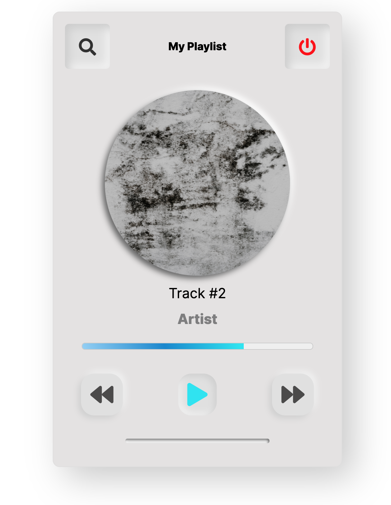

# Neumorphic Music Player

Let's polish up our UI skills and practice Flexbox layouts by creating the music player shown below -

### Instructions

> - All of the icons are from **Fontawesome**
> - The font we are using is _Inter_ from **Google Fonts**
> - Feel free to add a photo of an artist you like and include the artist and track name in the player
> - Mind the small details! Use different font weights `400, 700, 800` and don't forget to create a `linear-gradient` for the track progress bar
> - To help with the neumorphic elements, you can use the generator [here](https://neumorphism.io/#e0e0e0)
> - As always, **pixel perfect** :)

[//]: # (autograding info start)
#  Results
> ⌛ Give it a minute. As long as you see the orange dot  on top, CodeBuddy is still processing. Refresh this page to see it's current status.
>
> This is what CodeBuddy found when running your code. It is to show you what you have achieved and to give you hints on how to complete the exercise.

### Flexbox

|                 Status                  | Check                                                                                    |
| :-------------------------------------: | :--------------------------------------------------------------------------------------- |
|  | Page should be styled with flexbox |

### Gradient and shadow

|                 Status                  | Check                                                                                    |
| :-------------------------------------: | :--------------------------------------------------------------------------------------- |
|  | Track Progress Bar should be styled with CSS 'linear-gradient' property |
|  | Page should be styled with CSS 'box-shadow' property |

### Fonts and Icons

|                 Status                  | Check                                                                                    |
| :-------------------------------------: | :--------------------------------------------------------------------------------------- |
|  | Font awesome CDN should be loaded |
|  | Font awesome icons should be present on page |
|  | Page should contain Google fonts 'Inter' font |
|  | Page should be styled with different 'font-weights' |

[🔬 Results Details](../../actions)
[🐞 Tips on Debugging](https://github.com/DCI-EdTech/autograding-setup/wiki/How-to-work-with-CodeBuddy)
[📢 Report Problem](https://docs.google.com/forms/d/e/1FAIpQLSfS8wPh6bCMTLF2wmjiE5_UhPiOEnubEwwPLN_M8zTCjx5qbg/viewform?usp=pp_url&entry.652569746=UIB-layout-neumorphic-music-player)

[//]: # (autograding info end)